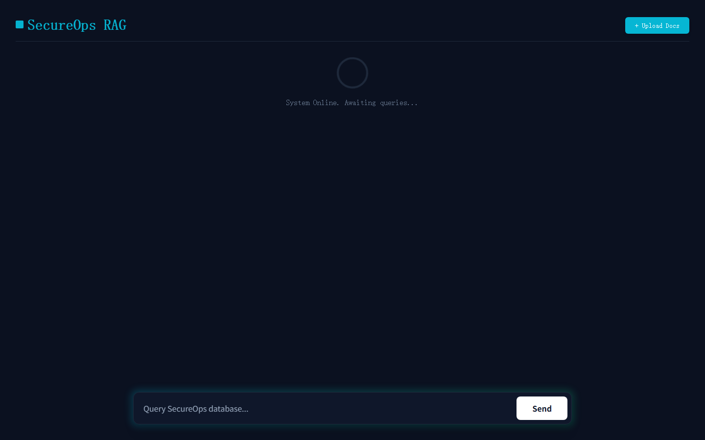

# SecureOps — Full-stack RAG Assistant for OT/ICS Cybersecurity

**English** | [简体中文](README.md)


SecureOps is a production-oriented Retrieval-Augmented Generation application
for industrial control system (ICS) and operational technology (OT) security.
It answers vulnerability and defensive-guidance questions from traceable CISA,
NIST, and MITRE sources, returns named citations, supports document upload, and
ships with a reproducible benchmark instead of hand-written performance claims.



## What this project demonstrates

- Source-aware ingestion for CSAF 2.0 JSON, NIST PDF, MITRE ATT&CK Excel,
  Vulnrichment CSV, and user PDF/TXT files.
- A full-corpus CVE cleaning pipeline that retains high-value OT records using
  explainable relevance and quality scores.
- BGE-small dense retrieval plus BM25 sparse retrieval, Reciprocal Rank Fusion
  (RRF), and cross-encoder reranking.
- Grounded DeepSeek generation with stable advisory, CVE, ATT&CK, and document
  citations plus retrieval-confidence display.
- FastAPI standard/streaming endpoints and a responsive Next.js interface.
- Persistent Docker volumes, health/status endpoints, automated tests, frontend
  lint/build checks, and GitHub Actions CI.
- A versioned 36-case benchmark with exact identifier labels and JSON/Markdown
  reports comparing dense search with the complete hybrid pipeline.

## Architecture

```text
CISA CSAF ─┐
NIST PDFs ─┼─> source-aware parsing ─> chunks ─┬─> BGE / ChromaDB ─┐
MITRE XLSX ┤                                   └─> BM25 ──────────┼─> RRF
CVE CSV ───┤                                                       │
Uploads ───┘                            query expansion ───────────┘
                                                                    ↓
                                                    cross-encoder reranking
                                                                    ↓
                                         grounded LLM + named citations
                                                                    ↓
                                                  FastAPI + Next.js UI
```

See [docs/architecture.md](docs/architecture.md) for component and trust-boundary
details.

## Knowledge base

| Source | Local snapshot | Purpose |
|---|---:|---|
| CISA CSAF Security Advisories | 200 advisories | Product/CVE/remediation-level evidence |
| NIST SP 800-82 Rev. 3 | September 2023 final | OT architecture and security guidance |
| NIST CSF 2.0 | February 2024 | Cybersecurity risk outcomes and governance |
| MITRE ATT&CK for ICS | v19.1 | Tactics, techniques, mitigations, assets, and relationships |
| CISA Vulnrichment-derived subset | 2,000 of 119,864 rows | Quality-ranked OT/ICS CVE enrichment |

The source inventory, canonical links, and provenance notes are in
[doc/SOURCES.md](doc/SOURCES.md). The raw 43 MB Vulnrichment CSV is not required
at runtime: the repository uses the generated `data/processed/cve_high_value.csv`.

### Data quality pipeline

`scripts/prepare_data.py` scans the complete raw export; it does not take the
first 2,000 rows. A record must have an explicit industrial vendor or OT/ICS term.
Eligible records are ranked by KEV status, CVSS severity, network reachability,
SSVC decision, metadata completeness, and recency. The selected rows retain
`quality_score` and `quality_reasons` for auditability.

Current measured cleaning result:

| Metric | Result |
|---|---:|
| Raw rows scanned | 119,864 |
| Eligible unique OT/ICS rows | 2,700 |
| Selected rows | 2,000 |
| Published in 2022–2026 | 1,981 (99.1%) |
| Critical or High severity | 1,567 (78.4%) |
| Mean quality score | 63.25 |

Full evidence: [reports/data_quality_report.md](reports/data_quality_report.md).

## Quick start with Docker

Requirements: Docker Desktop with the Linux engine running and a DeepSeek API
key. The embedding and reranking models run locally; only answer generation calls
the configured LLM endpoint.

```powershell
Copy-Item .env.example .env
# Edit .env and set DEEPSEEK_API_KEY. Never commit this file.

docker compose build

# First run: build a representative demo index.
docker compose run --rm api python scripts/build_index.py --quick

docker compose up -d
docker compose ps
```

Open <http://localhost:3000>. API docs are at <http://localhost:8000/docs>.

For the complete NIST documents, rebuild without `--quick`:

```powershell
docker compose run --rm api python scripts/build_index.py
```

The `rag-index` volume persists ChromaDB and BM25 data. Rebuilding an image does
not erase that volume, but source or chunking changes require an explicit index
rebuild.

## Local development

```powershell
python -m venv .venv
.\.venv\Scripts\Activate.ps1
pip install -r requirements.txt
python scripts/build_index.py --quick
uvicorn src.api:app --reload --port 8000
```

In a second terminal:

```powershell
Set-Location frontend
npm ci
npm run dev
```

The interactive terminal client remains available via `python src/cli.py`.

## API

| Method | Endpoint | Description |
|---|---|---|
| `GET` | `/health` | Liveness probe |
| `GET` | `/api/status` | Index, generator, CVE, and ATT&CK readiness |
| `POST` | `/api/ask` | JSON answer with citations and expanded queries |
| `POST` | `/api/ask_stream` | Streaming answer |
| `POST` | `/api/upload` | Validate PDF/TXT files and rebuild the index |

Example:

```powershell
$body = @{ query = "What does ATT&CK technique T0830 describe?" } | ConvertTo-Json
Invoke-RestMethod -Method Post -Uri http://localhost:8000/api/ask `
  -ContentType 'application/json' -Body $body
```

## Evaluation

The benchmark separates retrieval measurement from optional paid API generation.
It reports Hit@10, MRR@10, nDCG@10, context keyword coverage, mean latency, and
p95 latency for a dense baseline and the complete hybrid pipeline. Exact CISA and
MITRE identifiers are used where available; unanswerable cases are excluded from
retrieval scores and used only for live honest-rejection evaluation.

Current measured result on the 8,403-chunk CPU index:

| Metric | Dense baseline | Hybrid pipeline | Delta |
|---|---:|---:|---:|
| Hit@10 | 0.8125 | 0.9375 | +0.1250 |
| MRR@10 | 0.7396 | 0.8229 | +0.0833 |
| nDCG@10 | 0.7795 | 0.8789 | +0.0994 |
| Required-source coverage@10 | 0.9219 | 0.9688 | +0.0469 |
| Mean latency | 31.46 ms | 1,143.89 ms | +1,112.43 ms |

Cross-document Hit@10 is deliberately strict: every required source must appear
in the top 10. The current cross-document score is 0.50, exposing a real next
optimization target rather than hiding it behind source-level averages.

```powershell
# Measured retrieval evaluation; no LLM API calls.
docker compose run --rm api python -m src.evaluate

# Optional answer-generation and honest-rejection evaluation.
docker compose run --rm api python -m src.evaluate --with-generation
```

Outputs:

- [reports/evaluation_report.md](reports/evaluation_report.md) — reviewer-friendly summary.
- `reports/evaluation_report.json` — run manifest and per-case evidence.
- [data/evaluation_qa.json](data/evaluation_qa.json) — versioned ground truth.

## Tests and CI

```powershell
pytest -q
Set-Location frontend
npm run lint
npm run build
```

GitHub Actions runs the same backend and frontend gates on pushes and pull
requests.

## Repository structure

```text
.
├── src/
│   ├── ingestion/        # CSAF, PDF, CSV, ATT&CK, and upload parsers
│   ├── api.py            # FastAPI application
│   ├── indexing.py       # ChromaDB + BM25 index lifecycle
│   ├── retrieval.py      # dense/sparse/RRF/reranking pipeline
│   ├── generation.py     # grounded generation and citations
│   └── evaluate.py       # reproducible benchmark runner
├── scripts/              # non-interactive data/index/evaluation commands
├── frontend/             # Next.js user interface
├── data/                 # processed corpus, uploads, and benchmark cases
├── doc/                  # authoritative source snapshots and manifest
├── docs/                 # architecture documentation
├── reports/              # measured Markdown and JSON evidence
├── tests/                # unit and integration tests
├── Dockerfile
└── docker-compose.yml
```

## Scope and limitations

- SecureOps is a decision-support demo, not a vulnerability scanner or a
  substitute for vendor/CISA guidance.
- Source snapshots become stale. Refresh them and rerun cleaning, indexing, and
  evaluation before operational use.
- “Retrieval confidence” is a transformed reranker signal, not a calibrated
  probability that an answer is correct.
- The benchmark is project-owned and modest in size; it is suitable for regression
  testing, not a universal OT-security leaderboard.

## Contributing, security, and license

Contributions are welcome; see [CONTRIBUTING.md](CONTRIBUTING.md). Please report
security issues according to [SECURITY.md](SECURITY.md), not through a public
issue. The project source code is available under the [MIT License](LICENSE).
Third-party knowledge sources retain their respective provenance and terms as
documented in [doc/SOURCES.md](doc/SOURCES.md).

For a clean GitHub publication, follow
[docs/GITHUB_PUBLISHING.md](docs/GITHUB_PUBLISHING.md).

## Resume-ready summary

> Built SecureOps, a Dockerized full-stack OT/ICS RAG assistant using FastAPI,
> Next.js, ChromaDB, BGE embeddings, BM25, RRF, and cross-encoder reranking;
> engineered source-aware ingestion for CISA/NIST/MITRE data, an explainable
> full-corpus CVE quality pipeline, cited LLM responses, and a reproducible
> exact-ID retrieval benchmark with CI.
