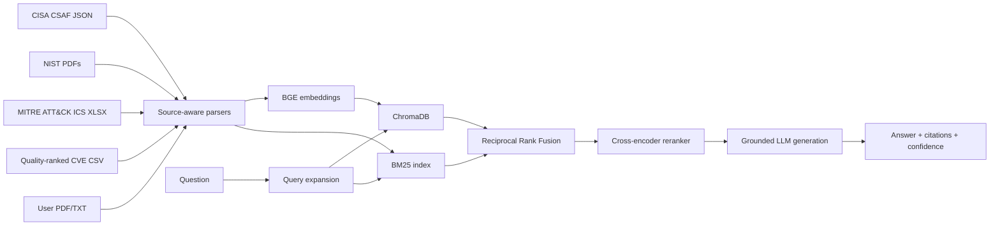

# Architecture

SecureOps is a full-stack Retrieval-Augmented Generation (RAG) system for
industrial control system and operational technology cybersecurity.

## Components

| Layer | Implementation | Responsibility |
|---|---|---|
| Ingestion | `src/ingestion/` | Parse CSAF, PDF, ATT&CK Excel, CVE CSV, and uploads into normalized chunks |
| Data quality | `cve_cleaner.py` | Full-file scan, OT relevance gate, deduplication, scoring, and audit report |
| Indexing | `src/indexing.py` | Persist normalized dense vectors and the BM25 corpus |
| Retrieval | `src/retrieval.py` | Dense + sparse recall, RRF fusion, and cross-encoder reranking |
| Generation | `src/generation.py` | Context-only answer generation, named citations, low-confidence behavior |
| API/UI | FastAPI + Next.js | Upload, status, standard and streaming question answering |
| Evaluation | `src/evaluate.py` | Dense baseline versus full hybrid pipeline with exact-ID relevance labels |

## Trust boundaries

- API keys stay in `.env` and are never copied into images or source control.
- Uploads are limited by extension, count, size, and path traversal checks.
- Retrieved text is untrusted evidence; generation is instructed to answer only
  from supplied context and to expose source identifiers.
- Evaluation reports distinguish measured retrieval results from optional live
  generation results.

## Index lifecycle

The index is rebuilt explicitly from versioned source files. Docker persists the
ChromaDB and BM25 artifacts in the `rag-index` volume, so container replacement
does not discard the index. Source changes require a rebuild.
